# Helix Shell (`hsh`)

[](https://github.com/adarshanand67/Helix-Shell/actions/workflows/ci.yml)
[](https://github.com/adarshanand67/Helix-Shell)
[](https://github.com/adarshanand67/Helix-Shell)
[](LICENSE)

A modern Unix shell with advanced features including autocompletion, colored prompts with Git integration, job control, pipelines, and I/O redirection.

## Quick Start

### Installation

#### macOS (Homebrew)

Install HelixShell via Homebrew:

```bash
brew tap adarshanand67/helix-shell
brew install helix-shell
helix
```

#### Docker (Cross-Platform)

```bash
docker pull adarshanand67/helixshell:latest
docker run -it --rm adarshanand67/helixshell:latest
```

Or build locally:
```bash
git clone https://github.com/adarshanand67/Helix-Shell.git
cd Helix-Shell
docker build -t helixshell .
docker run -it --rm helixshell
```

#### From Source

```bash
git clone https://github.com/adarshanand67/Helix-Shell.git
cd Helix-Shell
./scripts/setup.sh      # Install dependencies
mkdir build && cd build
cmake ..
make                   # Build the shell
./helix                # Run it
```

#### Linux/Debian/Ubuntu

For comprehensive Linux installation and testing instructions, including:
- Building from source on various distributions
- Creating Debian packages
- Setting up Ubuntu PPA
- Docker-based testing

See [docs/LINUX_TESTING.md](docs/LINUX_TESTING.md)
### Features

- **TAB Autocompletion**: Complete commands and file paths with TAB
- **Colored Prompt**: Beautiful prompt with Git branch integration and status indicators
- **Command History**: Navigate with arrow keys, search with Ctrl+R
- **Job Control**: Background jobs with `jobs`, `fg`, `bg` commands
- **Pipelines**: Chain commands with `|` operator
- **I/O Redirection**: Support for `>`, `<`, `>>`, `2>`, `&>`

## UML Class Diagram

```mermaid
classDiagram

%% Core Data Types
class Token {
    +TokenType type
    +std::string value
}

class Command {
    +std::vector~string~ args
    +std::string input_file
    +bool append_mode
    +std::string output_file
    +std::string error_file
    +bool error_append_mode
    +bool background
}

class Job {
    +int job_id
    +pid_t pgid
    +std::string command
    +JobStatus status
}

class CommandPipeline {
    +std::vector~Command~ commands
    +std::string original_command
}

class ParsedCommand {
    +CommandPipeline pipeline
    +bool background
}

class ShellState {
    +std::string current_directory
    +std::string home_directory
    +int last_exit_status
    +bool running
    +std::vector~string~ command_history
    +std::map~string,string~ environment
    +IJobManager* job_manager
    +Prompt* prompt
}

%% Enumerations
class JobStatus {
    <<enumeration>>
    RUNNING
    STOPPED
    DONE
    TERMINATED
}

class TokenType {
    <<enumeration>>
    WORD
    PIPE
    REDIRECT_IN
    REDIRECT_OUT
    REDIRECT_OUT_APPEND
    REDIRECT_ERR
    REDIRECT_ERR_APPEND
    BACKGROUND
    SEMICOLON
    END_OF_INPUT
}

%% Interfaces (Dependency Inversion Principle)
class IExecutableResolver {
    <<interface>>
    +findExecutable(command)* string
}

class IEnvironmentExpander {
    <<interface>>
    +expand(input)* string
}

class IFileDescriptorManager {
    <<interface>>
    +setupRedirections(cmd, input_fd, output_fd)* bool
    +restoreFileDescriptors()* void
}

class IPipelineManager {
    <<interface>>
    +executePipeline(cmd, executor_func)* int
}

class IBuiltinCommandHandler {
    <<interface>>
    +handle(cmd, state)* bool
    +canHandle(command)* bool
}

class IBuiltinDispatcher {
    <<interface>>
    +dispatch(cmd, state)* bool
    +isBuiltin(command)* bool
}

class IJobManager {
    <<interface>>
    +addJob(pid, command)* void
    +removeJob(job_id)* void
    +printJobs()* void
    +bringToForeground(job_id)* void
    +resumeInBackground(job_id)* void
    +getJobs()* map~int,Job~
}

%% Concrete Executor Components
class ExecutableResolver {
    +findExecutable(command) string
}

class EnvironmentVariableExpander {
    +expand(input) string
}

class FileDescriptorManager {
    -int original_stdin
    -int original_stdout
    -int original_stderr
    +setupRedirections(cmd, input_fd, output_fd) bool
    +restoreFileDescriptors() void
}

class PipelineManager {
    +executePipeline(cmd, executor_func) int
    -createPipes(count) vector~pair~int,int~~
    -cleanupPipes(pipes) void
    -waitForPipeline(pids) int
}

%% Concrete Shell Components
class BuiltinCommandHandler {
    <<abstract>>
    +handle(cmd, state)* bool
    +canHandle(command)* bool
}

class CdCommandHandler {
    +handle(cmd, state) bool
    +canHandle(command) bool
}

class ExitCommandHandler {
    +handle(cmd, state) bool
    +canHandle(command) bool
}

class HistoryCommandHandler {
    +handle(cmd, state) bool
    +canHandle(command) bool
}

class JobsCommandHandler {
    +handle(cmd, state) bool
    +canHandle(command) bool
}

class FgCommandHandler {
    +handle(cmd, state) bool
    +canHandle(command) bool
}

class BgCommandHandler {
    +handle(cmd, state) bool
    +canHandle(command) bool
}

class BuiltinCommandDispatcher {
    -map~string,unique_ptr~BuiltinCommandHandler~~ handlers
    +dispatch(cmd, state) bool
    +isBuiltin(command) bool
}

class JobManager {
    -map~int,Job~ jobs
    -int next_job_id
    +addJob(pid, command) void
    +removeJob(job_id) void
    +printJobs() void
    +bringToForeground(job_id) void
    +resumeInBackground(job_id) void
    +getJobs() map~int,Job~
}

%% Main Classes
class Executor {
    -unique_ptr~IExecutableResolver~ exe_resolver
    -unique_ptr~IEnvironmentExpander~ env_expander
    -unique_ptr~IFileDescriptorManager~ fd_manager
    -unique_ptr~IPipelineManager~ pipeline_manager
    +Executor()
    +Executor(resolver, expander, fd_mgr, pipe_mgr)
    +execute(cmd) int
    -executeSingleCommand(cmd, input_fd, output_fd) int
    -executeCommandInChild(cmd) void
}

class Shell {
    -ShellState state
    -unique_ptr~Tokenizer~ tokenizer
    -unique_ptr~Parser~ parser
    -unique_ptr~Executor~ executor
    -unique_ptr~IBuiltinDispatcher~ builtin_dispatcher
    -unique_ptr~IJobManager~ job_manager
    +Shell()
    +run() int
    -showPrompt() void
    -readInput() string
    -processInput(input) bool
}

class Tokenizer {
    +tokenize(input) vector~Token~
    -processNormalState(...)
    -processDoubleQuoteState(...)
    -processSingleQuoteState(...)
}

class Parser {
    +parse(tokens) ParsedCommand
    -parseSingleCommand(...) Command
}

class Prompt {
    +generate() string
    +setUserHost(...) void
    +setCurrentDirectory(...) void
    -getGitBranch() string
}

%% Relationships - Interfaces
IExecutableResolver <|.. ExecutableResolver : implements
IEnvironmentExpander <|.. EnvironmentVariableExpander : implements
IFileDescriptorManager <|.. FileDescriptorManager : implements
IPipelineManager <|.. PipelineManager : implements
IBuiltinCommandHandler <|.. BuiltinCommandHandler : implements
IBuiltinDispatcher <|.. BuiltinCommandDispatcher : implements
IJobManager <|.. JobManager : implements

%% Relationships - Executor Composition (uses interfaces)
Executor --> IExecutableResolver : depends on
Executor --> IEnvironmentExpander : depends on
Executor --> IFileDescriptorManager : depends on
Executor --> IPipelineManager : depends on

%% Relationships - Shell Composition (uses interfaces)
Shell --> IBuiltinDispatcher : depends on
Shell --> IJobManager : depends on
Shell --> Tokenizer : uses
Shell --> Parser : uses
Shell --> Executor : uses
Shell --> ShellState : has
ShellState --> IJobManager : references
ShellState --> Prompt : has

%% Relationships - Builtin Handlers (Strategy Pattern)
BuiltinCommandHandler <|-- CdCommandHandler : extends
BuiltinCommandHandler <|-- ExitCommandHandler : extends
BuiltinCommandHandler <|-- HistoryCommandHandler : extends
BuiltinCommandHandler <|-- JobsCommandHandler : extends
BuiltinCommandHandler <|-- FgCommandHandler : extends
BuiltinCommandHandler <|-- BgCommandHandler : extends
BuiltinCommandDispatcher --> BuiltinCommandHandler : manages

%% Data Type Relationships
Tokenizer ..> Token : creates
Parser ..> ParsedCommand : creates
Parser ..> Command : creates
Parser ..> CommandPipeline : creates
Executor ..> Command : executes
ParsedCommand --> CommandPipeline : contains
CommandPipeline --> Command : contains
Job --> JobStatus : has
Token --> TokenType : has
JobManager --> Job : manages
```



## Architecture: Composition-Based Design

HelixShell v2.0 employs a **composition-based architecture** to achieve modularity, testability, and maintainability. The codebase has been refactored from monolithic classes into smaller, focused components that follow the **Single Responsibility Principle**.

### Component Organization

The codebase is organized into logical subdirectories:

```
include/
├── executor/          # Command execution components
│   ├── executable_resolver.h
│   ├── environment_expander.h
│   ├── fd_manager.h
│   └── pipeline_manager.h
├── shell/             # Shell REPL and builtin components
│   ├── builtin_handler.h
│   ├── job_manager.h
│   └── shell_state.h
├── executor.h         # Main executor (uses composition)
├── shell.h            # Main shell (uses composition)
├── parser.h
├── tokenizer.h
├── prompt.h
└── types.h
```

### Executor Components

The `Executor` class delegates specialized tasks to focused components:

**ExecutableResolver** (`~60 lines`)
- Searches for executables in PATH directories
- Validates file permissions and executability
- Handles absolute and relative paths

**EnvironmentVariableExpander** (`~45 lines`)
- Expands `$VAR` and `${VAR}` syntax in command arguments
- Handles missing environment variables gracefully

**FileDescriptorManager** (`~130 lines`)
- Saves and restores original file descriptors
- Sets up input/output/error redirections
- Handles file opening with appropriate flags (append, truncate)

**PipelineManager** (`~125 lines`)
- Creates pipes between commands
- Forks processes for each command in pipeline
- Sets up proper pipe connections
- Waits for all pipeline processes and returns exit status

**Benefits:**
- **Reduced Complexity**: Main executor reduced from 435 lines to ~180 lines
- **Testability**: Each component can be unit tested independently
- **Maintainability**: Changes to one aspect (e.g., PATH resolution) don't affect others

### Shell Components

The `Shell` class uses composition for:

**BuiltinCommandHandler** (~160 lines total)
- Strategy pattern for extensible builtin commands
- Individual handlers: `CdCommandHandler`, `ExitCommandHandler`, `HistoryCommandHandler`, `JobsCommandHandler`, `FgCommandHandler`, `BgCommandHandler`
- `BuiltinCommandDispatcher` routes commands to appropriate handlers

**JobManager** (~50 lines)
- Manages background and foreground jobs
- Tracks job status (Running, Stopped, Done, Terminated)
- Provides job control operations (add, remove, foreground, background)

**ShellState** (~30 lines)
- Encapsulates all shell state in one structure
- Includes: current directory, home directory, exit status, command history, running flag
- Simplifies state management and makes it explicit

**Benefits:**
- **Reduced Complexity**: Main shell reduced from 425 lines to ~315 lines
- **Extensibility**: New builtin commands can be added without modifying Shell class
- **Clear State Management**: All state in one structure, easier to reason about

### Design Patterns Used

1. **Dependency Inversion Principle (DIP)**: High-level modules (Executor, Shell) depend on abstractions (interfaces), not concrete implementations
   - All executor components implement interfaces: `IExecutableResolver`, `IEnvironmentExpander`, `IFileDescriptorManager`, `IPipelineManager`
   - All shell components implement interfaces: `IBuiltinCommandHandler`, `IBuiltinDispatcher`, `IJobManager`
   - Enables easy testing with mock implementations and runtime polymorphism

2. **Composition over Inheritance**: Components are composed, not inherited
   - Executor composes 4 specialized components instead of implementing all logic
   - Shell composes state, dispatcher, and job manager components

3. **Strategy Pattern**: Builtin command handlers are swappable strategies
   - Each builtin command (`cd`, `exit`, `history`, etc.) has its own handler class
   - `BuiltinCommandDispatcher` routes commands to appropriate strategies

4. **Dependency Injection**: Components receive dependencies via constructor
   - Executor has two constructors: default (production) and DI constructor (testing)
   - Shell receives all components through unique pointers for testability

5. **Single Responsibility Principle**: Each class has one clear purpose
   - `ExecutableResolver`: Only finds executables in PATH
   - `FileDescriptorManager`: Only handles FD redirections
   - `PipelineManager`: Only manages pipeline execution

6. **RAII (Resource Acquisition Is Initialization)**: Smart pointers manage component lifetimes
   - All components use `std::unique_ptr` for automatic cleanup
   - No manual memory management, preventing leaks

### Code Metrics

| Metric | Before Refactoring | After Refactoring | Improvement |
|--------|-------------------|-------------------|-------------|
| Executor LOC | 435 | 180 | -59% |
| Shell LOC | 425 | 315 | -26% |
| Number of Classes | 7 | 17 | +143% (better modularity) |
| Average Class Size | ~200 lines | ~70 lines | -65% |
| Test Coverage | 48 tests passing | 48 tests passing | ✅ Maintained |

## 1. Executive Summary

Helix Shell (`hsh`) is a custom command-line interpreter designed to emulate the core functionality and behavior of standard Unix shells like Bash, Zsh, or Dash. The primary objective is to construct a robust, interactive environment that serves as the vital bridge between the user and the operating system kernel, facilitating process execution, resource management, and system navigation.

Unlike feature-bloated modern shells that include scripting engines, plugins, and theme managers, Helix focuses on the "pure" Unix philosophy: doing one thing well. This project serves a dual purpose, bridging practical utility with rigorous academic exploration:

**Functional Utility**: To provide a lightweight, responsive, and transparent shell. It is capable of handling complex command chains, multi-stage piping, and sophisticated job control mechanisms. It is designed for users who need a minimal yet powerful interface for system interaction without the latency or overhead of heavier interpreters.

**Educational Mastery**: To demonstrate deep, hands-on proficiency in C++ systems programming. The development process demands mastering the intricacies of the Unix process model. This involves:

- **Process Lifecycle**: Orchestrating the fork, exec, wait triad to manage process creation and termination.
- **Memory Management**: Implementing precise resource allocation and deallocation strategies to prevent leaks in a long-running, stateful application.
- **Inter-Process Communication (IPC)**: Utilizing anonymous pipes and file descriptor manipulation to facilitate data flow between independent processes.
- **Signal Handling**: Managing asynchronous events (interrupts, process state changes) to ensure the shell remains stable under user stress.

## 2. User Stories

### 2.1. Core Execution & Navigation

**As a User**, I want to execute standard Linux commands (e.g., `ls -la`, `grep`, `cat`, `vim`) by searching the system PATH. The shell should locate binaries in `/bin`, `/usr/bin`, etc., so I can interact with the file system and run installed applications seamlessly without typing absolute paths.

**As a User**, I want to navigate the file system using `cd`. This includes handling relative paths (`..`), absolute paths (`/tmp`), and the home alias (`~`), ensuring my environment context tracks these changes accurately.

**As a User**, I want the prompt to be informative but clean, showing my current directory and username, so I always know the context of my commands.

### 2.2. Pipeline & Data Flow

**As a User**, I want to chain commands using pipes (`|`) to create processing pipelines (e.g., `cat logs | grep error | sort | uniq -c`). The shell must pass the standard output of one utility directly as the standard input to the next, allowing for powerful data transformation workflows.

**As a User**, I want to redirect input and output to files using standard operators:

- `>` to overwrite files (e.g., saving logs).
- `>>` to append to files (e.g., adding a line to a config).
- `<` to feed file contents into commands (e.g., SQL queries).

**As a User**, I want to redirect Standard Error (`2>`) separately from Standard Output, allowing me to filter error logs from normal program output.

### 2.3. Job Control & Multitasking

**As a User**, I want to run long-running processes in the background by appending `&` to the command (e.g., `sleep 10 &`). This should return control of the prompt immediately, allowing me to continue working while the task completes asynchronously.

**As a User**, I want to view a list of active jobs using the `jobs` command, seeing their status (Running, Stopped, Done) and unique Job IDs.

**As a User**, I want to use `Ctrl+C` (SIGINT) to safely stop a runaway foreground command without terminating the entire shell session.

**As a User**, I want to use `Ctrl+Z` (SIGTSTP) to pause a running foreground task and return to the prompt, with the ability to resume it later in the foreground (`fg`) or background (`bg`).

### 2.4. Usability & Persistence

**As a User**, I want a history feature that persists commands in memory. I should be able to see a list of my past actions (`history`) and re-execute complex strings without retyping, increasing my efficiency.

**As a User**, I want the shell to handle errors gracefully. If I make a typo or try to execute a non-existent command, the shell should print a helpful error message (e.g., "helix: command not found: foo") rather than crashing.

## 3. Functional Requirements

### 3.1. The Command Cycle (REPL)

The shell must implement a robust Read-Eval-Print Loop (REPL) that handles user interaction continuously:

**Prompt Display:**
- Display a contextual prompt before reading input.
- Format: `[user@hostname: cwd]$`
- Logic: The cwd path must be shortened to `~` if the user is inside their home directory. If the path is too long, it should ideally be truncated or formatted for readability.

**Input Reading:**
- Accept dynamic length input from stdin using `std::getline`.
- Handle EOF (`Ctrl+D`) gracefully by exiting the shell cleanly.
- Prevent buffer overflows regardless of input length.

**Tokenization & Parsing (The Lexer):**
- Parse the raw input string into a structured format (e.g., `struct Command`).
- Delimiters: Use whitespace (space, tab) to separate arguments.
- Quoting: Implement state-machine logic to handle double quotes (`""`) and single quotes (`''`). Content within quotes must be treated as a single argument, preserving internal spaces (e.g., `echo "hello world"` → 2 args: `echo`, `hello world`).
- Escaping: Support the backslash (`\`) to escape special characters (e.g., `\"`, `\$`, `\\`).
- Metacharacters: Identify and separate control operators (`|`, `<`, `>`, `>>`, `&`, `2>`) from normal arguments. These dictate the execution flow and must not be passed to the command itself.

### 3.2. Command Execution Engine

**External Commands:**
- **Path Resolution**: If the command does not contain a slash (`/`), the shell must iterate through the directories in the `PATH` environment variable to find the executable.
- **Execution**: Use `execvp` (or `execv` with manual path resolution). This replaces the current process image with the new program.
- **Error Handling**: If `exec` fails (e.g., file not found, permission denied), the child process must print an error to stderr and exit with a specific status code (127 for not found, 126 for not executable).

**Process Creation Strategy:**
- **Forking**: Use `fork()` to create a child process for every external command.
- **Parent Responsibility**: The parent (shell) tracks the child's PID.
- **Synchronization**: Use `waitpid()` to block execution until the child terminates, unless it is a background job. The shell must capture the exit status of the child to handle conditional logic or error reporting.

### 3.3. Built-in Commands

These commands modify the shell's internal state and must be executed within the parent process, without forking:

**cd [dir]:**
- Change the current working directory using `chdir()`.
- Default: If no argument is provided, change to `$HOME`.
- Previous: Support `cd -` to toggle to the previous directory.
- Updates: Update `PWD` and `OLDPWD` environment variables upon success.

**exit [code]:**
- Terminate the shell session.
- Cleanup: Free all allocated memory, kill running background jobs (optional but recommended), and close open file descriptors.
- Status: Exit with the provided numeric code or the status of the last executed command.

**history:**
Shell --> Job : manages
Executor ..> Command : executes
ParsedCommand --> CommandPipeline : contains
CommandPipeline --> Command : contains
Job --> JobStatus : has
Token --> TokenType : has

**fg [job_id]:**
- Bring a background/stopped job to the foreground.
- Give the job control of the terminal (`tcsetpgrp`) and send `SIGCONT` if it was stopped.
- Wait for it to finish.

**bg [job_id]:**
- Resume a stopped job in the background.
- Send `SIGCONT` to the process group.


### 3.4. Advanced I/O & Piping

The shell acts as a traffic controller for file descriptors (FDs):

**Redirection Implementation:**
- **Logic**: In the child process, before calling `exec`, open the specified files.
- **`>`**: Open with `O_WRONLY | O_CREAT | O_TRUNC`. Use `dup2(fd, STDOUT_FILENO)`.
- **`>>`**: Open with `O_WRONLY | O_CREAT | O_APPEND`. Use `dup2(fd, STDOUT_FILENO)`.
- **`<`**: Open with `O_RDONLY`. Use `dup2(fd, STDIN_FILENO)`.
- **Safety**: Close the original file descriptor after `dup2` to avoid leaks.

**Piping (`|`) Implementation:**
- Create a pipe using `pipe()` which returns two FDs: `read_end` and `write_end`.
- **Left Command**: Connects stdout to `write_end`. Closes `read_end`.
- **Right Command**: Connects stdin to `read_end`. Closes `write_end`.
- **Multi-stage**: For `cmd1 | cmd2 | cmd3`, the shell must manage multiple pipe pairs. `cmd2` reads from pipe A and writes to pipe B.
- **Critical**: The parent process must close all pipe ends after forking children. If the parent keeps a write-end open, the reading child will never detect EOF and will hang indefinitely.

### 3.5. Signal Handling & Job Control

The shell must maintain stability and manage process groups:

**Signal Masking:**
- **SIGINT (Ctrl+C)**: The shell ignores this or catches it to reset the prompt input line. It must not terminate.
- **SIGTSTP (Ctrl+Z)**: The shell ignores this. It is meant for the foreground child process.
- **SIGTTOU**: The shell should ignore this to avoid being stopped when it tries to write to the terminal from the background (during job control handovers).

**Job Control Logic:**
- **Process Groups**: Every pipeline must run in its own Process Group ID (PGID). The shell uses `setpgid()` to ensure all processes in a pipe (e.g., `cat | grep`) belong to the same group.
- **Terminal Control**: The shell uses `tcsetpgrp()` to give the terminal focus to the foreground process group. When the foreground job finishes or stops, the shell must reclaim terminal control using `tcsetpgrp()` on its own PGID.
- **SIGCHLD Handler**: An asynchronous handler catches status changes (termination, stop, continue) of child processes. It calls `waitpid` with `WNOHANG | WUNTRACED` to update the JobManager status without blocking the main loop.

## 4. Non-Functional Requirements

### 4.1. Performance & Efficiency

- **Latency**: Command execution overhead should be negligible (< 5ms added to system call time).
- **Memory**: The shell should have a small memory footprint.
- **Leak Freedom**: Strict adherence to RAII (Resource Acquisition Is Initialization). All pointers must be managed (smart pointers preferred). Use valgrind to verify no leaks occur during parsing or execution loops.

### 4.2. Robustness

- **Error Recovery**: The parser must recover from syntax errors (e.g., unclosed quotes) by discarding the current line and printing an error, resetting the state for the next prompt.
- **Stress Testing**: The shell must handle rapid inputs, large outputs piped to `/dev/null`, and binary files cat-ed to the terminal without crashing.

### 4.3. Maintainability

- **Modularity**: The code must be separated into logical units:
  - **Lexer/Parser**: String manipulation.
  - **Executor**: System calls and process logic.
  - **Builtins**: Implementations of internal commands.
  - **Signals**: Handlers and masks.
- **Style**: Google C++ Style Guide. Comprehensive comments for complex logic (especially the pipe/dup2 dance).

## 5. Technical Architecture

### 5.1. System Components Diagram

- **main.cpp**: Entry point. Initializes signals, loads config (if any), and enters the REPL.
- **Shell (Singleton)**:
  - Maintains env (environment map).
  - Maintains cwd (current path).
  - Maintains job_list (list of active jobs).
  - Maintains history (vector of strings).
- **Tokenizer**:
  - Input: `std::string raw_input`
  - Output: `std::vector<Token>`
  - Handles state (Normal, InDoubleQuote, InSingleQuote).
- **Parser**:
  - Input: `std::vector<Token>`
  - Output: `std::vector<Command>` (The execution plan).
  - Groups tokens into commands based on pipes (`|`).
  - Identifies redirection tokens and assigns them to the relevant Command struct.
- **Executor**:
  - Iterates through `std::vector<Command>`.
  - Manages `pipe()` creation for the chain.
  - Calls `fork()`.
  - In Child: Calls `dup2` for redirections, closes pipes, executes `execvp`.
  - In Parent: Closes pipes, handles `waitpid` or backgrounding logic.
- **JobManager**:
  - Struct Job: `{ int job_id, pid_t pgid, string command, Status state }`.
  - Methods: `addJob()`, `removeJob()`, `getJob()`, `printJobs()`, `updateStatus()`.

### 5.2. Critical Data Structures

```cpp
struct Command {
    std::vector<std::string> args; // args[0] is the binary
    std::string input_file;        // for < redirection
    std::string output_file;       // for > or >> redirection
    bool append_mode = false;      // true if >>
    // ... other flags
};
```

Job List: A `std::map<int, Job>` or `std::vector<Job>` to store active background processes, enabling O(1) or O(N) lookup by Job ID.

## 6. Milestones & Timeline

| Phase    | Duration | Focus                 | Key Deliverables                      | Risk Assessment                          |
|----------|----------|-----------------------|--------------------------------------|------------------------------------------|
| Phase 1  | Week 1   | Foundation           | Repo setup, Makefile, REPL loop, basic Tokenizer. | Low: Basic C++ setup. |
| Phase 2  | Week 2   | Process Core         | fork/exec/wait implementation. Single command execution. cd built-in. | Medium: Getting fork logic right can be tricky for beginners. |
| Phase 3  | Week 3   | I/O & Pipes          | Redirection (<, >, >>). Single pipes (`\|`). | Medium: FD management is critical. |
| Phase 4  | Week 4   | Multi-Pipes          | Support for N-command pipelines. Logic generalization. | High: Complexity increases significantly with multiple pipes. |
| Phase 5  | Week 5   | Job Control          | & backgrounding, jobs, fg, bg, Signal handlers (SIGINT, SIGTSTP). | Critical: Managing terminal control groups (tcsetpgrp) is complex and prone to stopping the shell itself. |
| Phase 6  | Week 6   | Polish & Test        | History, quoting support (spaces in filenames), memory audit (Valgrind), Documentation. | Medium: Time management is key here. |

## 7. AI Prompts for Development

Use these specific, context-aware prompts to assist you in coding specific modules.

**Prompt 1: Robust Tokenization Strategy**
"I need to implement a tokenizer for a Unix shell in C++. The input string is `ls -l "my file" | grep "key word" > out.txt`.
Create a Tokenizer class that breaks this into tokens. It must:
- Use a state machine (Normal, InDoubleQuote, InSingleQuote) to handle spaces inside quotes.
- Treat |, <, > as separate tokens even if they touch words (e.g., ls>out becomes ls, >, out).
- Return a `std::vector<std::string>`. Provide the C++ implementation."

**Prompt 2: The Pipe Execution Loop**
"I am implementing the execution engine for a shell in C++. I have a `std::vector<Command>` where each Command represents a stage in a pipeline (e.g., cmd1 | cmd2 | cmd3).
Write a function `executePipeline(std::vector<Command>& cmds)` that:
- Iterates through the commands.
- Creates pipes using `pipe()` as needed.
- Forks a child for each command.
- Uses `dup2` to wire stdout of the current child to the stdin of the next.
- Crucially: Shows exactly where to close the pipe file descriptors in the parent and the child to effectively prevent deadlocks.
- Waits for all children to finish."

**Prompt 3: Signal Handler for Job Control**
"I am adding job control to my C++ shell.
- How do I set up `sigaction` to catch `SIGCHLD` asynchronously?
- Inside the handler, how do I use `waitpid` with `WNOHANG` to clean up zombie processes without blocking the shell?
- Explain how to update a global JobManager data structure safely from within this signal handler (or explain why I shouldn't and what the alternative pattern is, like the 'Self-Pipe Trick')."

**Prompt 4: Managing Terminal Foreground Groups**
"Explain the concept of Terminal Process Groups (`tcsetpgrp`) in the context of a custom shell.
- When I run a command like `vim`, how do I give it control of the terminal so it receives keyboard input?
- When `vim` exits or is stopped with `Ctrl+Z`, how does the shell regain control? Provide a C++ code snippet demonstrating this handover."

## 8. Deliverables Checklist

### Source Code Repository:
- **src/**: Cleanly separated .cpp files.
- **include/**: Header files with include guards.
- **tests/**: Unit tests for the parser and integration tests for the shell.

### Build Artifacts:
- **Makefile**: Configuration for building the hsh binary and running tests.
- **hsh**: The compiled executable.

### Documentation:
- **README.md**: Setup guide, features, and known bugs.
- **ARCHITECTURE.md**: A diagram or text explanation of the data flow.
- **MANUAL.md**: A user guide explaining supported commands and syntax.

### Verification:
- **Valgrind Output Report** showing 0 bytes definitively lost.
- **Test script execution logs** confirming feature parity with requirements.

## Dependencies

This project requires the following dependencies for building and testing:

### macOS (with Homebrew)

Run the automated setup script:

```bash
./scripts/setup.sh
```

#### Configuration

Customize your HelixShell experience with `.helixrc`:

```bash
# Copy the example config to your home directory
cp .helixrc ~/.helixrc

# Edit colors, themes, and prompt format
nano ~/.helixrc
```

Features:
- **Color Themes**: Choose from preset themes (Solarized, Gruvbox, Dracula, etc.)
- **Custom Prompts**: Design your own prompt format with variables
- **Git Integration**: Customize Git branch display
- **Behavior Settings**: Configure history, completion, and job control

This script will automatically install and verify:
- **Make**: Build system
- **pkg-config**: Build configuration tool
- **CppUnit**: Unit testing framework for C++

### Manual Installation

If you prefer manual installation:

```bash
brew install pkg-config cppunit
```

## Developer Setup

### 1. Install Dependencies

```bash
brew install pkg-config cppunit
```

### 2. Setup Git Hooks (Required for contributors)

```bash
./scripts/setup-hooks.sh
```

This installs:
- **Pre-commit hook**: Build checks, code quality validation
- **Pre-push hook**: Full build + test suite validation

See [scripts/README.md](scripts/README.md) for details.

## Building

### Standard Build

```bash
mkdir build && cd build
cmake ..
make
```

### Build with Tests

```bash
mkdir build && cd build
cmake ..
make
make tests
```

### Clean Build

```bash
rm -rf build
mkdir build && cd build
cmake ..
make
```

## Running

```bash
# Run the shell
./build/hsh

# Run tests
make test
```

## Current Implementation Status

- ✅ **Project Setup**: CMake build system, modular architecture, Git hooks
- ✅ **REPL Loop**: Interactive prompt with user@hostname:cwd format, Git integration, colored status indicators
- ✅ **Tab Autocompletion**: Command and path completion using readline library
- ✅ **Tokenizer**: State machine parsing with quotes, escapes, metacharacters
- ✅ **Parser**: Converts tokens to structured Command objects
- ✅ **Single Command Execution**: fork/exec/wait with PATH resolution and environment variable expansion
- ✅ **Full I/O Redirection**: `<`, `>`, `>>`, `2>`, `2>>` support
- ✅ **Pipeline Support**: `|` operator for command chaining (multi-stage)
- ✅ **Built-in Commands**: `cd` (with `-` support), `exit`, `history`, `jobs`
- ✅ **Error Handling**: Proper error messages and exit codes
- ❌ **Background Jobs**: `&` operator not implemented
- ❌ **Job Control**: `fg`, `bg` commands are placeholders (SIGCHLD/signal handling not implemented)
- ❌ **`export` built-in**: Environment variable setting not implemented
- ❌ **`pwd` built-in**: Not implemented (though autocompletion includes it)
